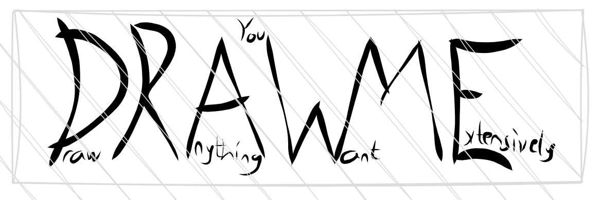
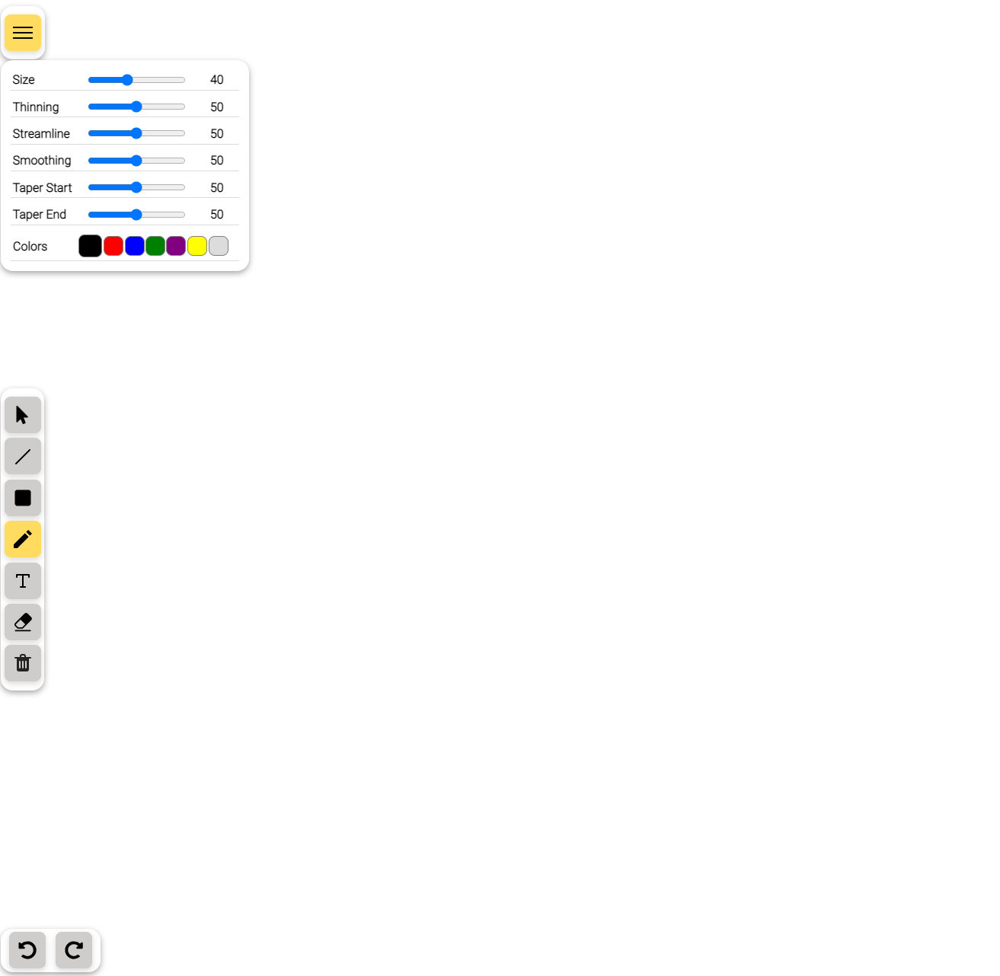

<p align="center">

</p>

DraWMe is a canvas-based desktop drawing application where you can draw anything you want.

Live Vercel version available here: https://drawing-app-reactjs.vercel.app/

## Content

- [Introduction](#introduction)
- [Used Technologies](#used-technologies)
- [Libraries](#libraries)
- [Installation](#installation)
- [Previews](#previews)

<br>

# Introduction

DraWMe is a canvas-based desktop drawing app that allows users to draw by using tools like freehand sketches, lines, rectangles, and texts. All the drawing pieces can be moved where ever you want! The rectangles and line tools have an extra feature which is resizing. You can resize them as you wish! Every tool has its own styling panel (except the text tool) where you can change colors, roughness, size, smoothness, stroke width, hachure gap and angle, and many more! You can delete your drawings with clear all trash bin or by simply using the eraser tool. If you accidentally delete something, no problem! We have redo-undo buttons to get those drawings back! Enjoy the application :)!

Known Issues: Deleting drawings inside of the rectangles will delete the rectangle first, and then the other drawings inside of the rectangle. It is better to move the rectangle first, then delete it. It will be fixed soon!

<br>

## Used Technologies

- HTML
- JavaScript
- ReactJS
- SASS
- Vercel

<br>

## Libraries

- Perfect-freehand
- Roughjs

<br>

## Installation

- First, clone the project:

```sh
git clone https://github.com/eakarr/drawing-app-reactjs.git
```

- Then, start the project on localhost:

```bash
# install dependencies with npm
npm install

# serve at localhost:3000
npm start
```

<br>
<br>

# Previews

<center>

## Canvas

<p align="center">

</p>

</center>

<br>
<br>
